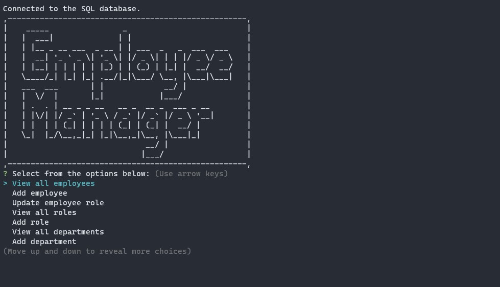

# Employee Tracker
  
Click video for application walkthrough using seeded data!

## Table of Contents 
* [Description](#Description) 

* [Installation](#Installation) 

* [Usage](#Usage) 

* [License](#License) 

* [Contributing](#Contributing) 

* [Testing](#Testing) 

* [Questions](#Questions) 

### Description
Command line CMS (content management system) that can be used to actively manage a companies mySQL database.

### Installation
1. Project is setup to use an .env file to protect sensitive database usernames and passwords. Using the supplied .env.EXAMPLE file in root directory, rename file to be that of .env (removing .EXAMPLE) and fill in required variables of DB_USER and DB_PASSWORD with your own mySQL username and password. 
2. Run mySQL in root folder. `source db/schema.sql` to setup working database. `source db/seeds.sql` to seed database with supplied data. You may exit mySQL once setting up schema and seeding is done. 
3. `npm install` in root directory, to install required application dependencies.
4. `npm start` to start application. 

### Usage
1. Start application via: `npm start`.
2. Choose desired selection and follow on-screen prompts.
3. To exit program, click exit from within application menu.

### License
Further information regarding this specific license can be found via: https://opensource.org/license/mit/.  

### Contributing
Open <a href="https://github.com/MisterBham/employee-tracker/issues" target="_blank">Issues</a> on the repo!

### Testing
No tests provided at this time. 

### Questions
Should you have any further questions, please reach the developer at: misterbham.dev@gmail.com.  
GitHub: <a href="https://github.com/MisterBham">MisterBham</a>

